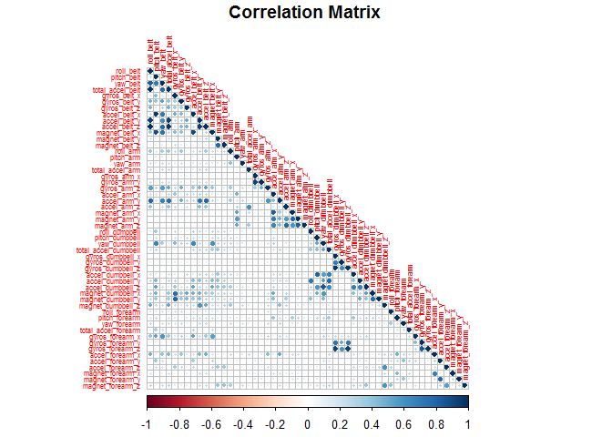
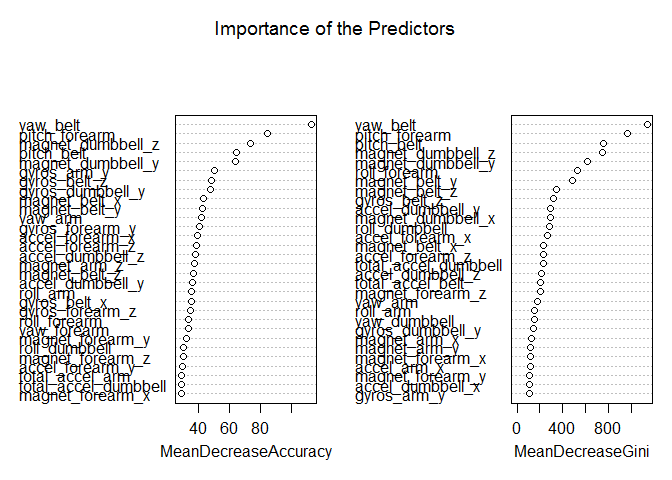

# Practical Machine Learning - Prediction Assignment Writeup
Roshan Shah  
Thursday, July 23, 2015  

Background
--------------------------------------------
Using devices such as Jawbone Up, Nike FuelBand, and Fitbit it is now possible to collect a large amount of data about personal activity relatively inexpensively. These type of devices are part of the quantified self movement - a group of enthusiasts who take measurements about themselves regularly to improve their health, to find patterns in their behavior, or because they are tech geeks. One thing that people regularly do is quantify how much of a particular activity they do, but they rarely quantify how well they do it. In this project, your goal will be to use data from accelerometers on the belt, forearm, arm, and dumbell of 6 participants. They were asked to perform barbell lifts correctly and incorrectly in 5 different ways. More information is available from the website here: http://groupware.les.inf.puc-rio.br/har (see the section on the Weight Lifting Exercise Dataset). 

The goal of the project is to predict the manner in which they did the exercise. This is the "classe" variable in the training set. You may use any of the other variables to predict with. You should create a report describing how you built your model, how you used cross validation, what you think the expected out of sample error is, and why you made the choices you did. You will also use your prediction model to predict 20 different test cases.

Data
--------------------------------------------

First, we need to read in the training and test data sets.


```r
training <- read.csv("https://d396qusza40orc.cloudfront.net/predmachlearn/pml-training.csv",na.strings=c("", "NA", "NULL"))
testing <- read.csv("https://d396qusza40orc.cloudfront.net/predmachlearn/pml-testing.csv",na.strings=c("", "NA", "NULL"))
```


```r
dim(training)
```

```
## [1] 19622   160
```

```r
dim(testing)
```

```
## [1]  20 160
```

Let's get some summary statistics on the training dataset.

```r
summary(training)
```

- Remove variables that don't have predictive value

```r
remove <- c("X", "user_name", "raw_timestamp_part_1", "raw_timestamp_part_2","cvtd_timestamp","new_window", "num_window")
training <- training[,!(names(training) %in% remove)]
dim(training)
```

```
## [1] 19622   153
```

- The summary stats revealed many variables with NAs. We could try to impute these variables using method "knnImpute" from the preProcess function, but since we have so many covariates, let's just filter them out.
  

```r
training <- training[ , colSums(is.na(training)) == 0]
dim(training)
```

```
## [1] 19622    53
```

Before we start building a model, let's remove the zero covariates


```r
any(nearZeroVar(training, saveMetrics = TRUE)$nzv == TRUE)
```

```
## [1] FALSE
```

None of the predictors have near zero variance, so we will not eliminate any based on this criteria. However, let's continue pre-processing by evaluating the correlation between variables and remove predictors with a correlation of greater than 0.90. 


```r
M <- abs(cor(training[,-53]))
```

```r
corrplot(M, type="lower", tl.cex = 0.5, main="Correlation Matrix")
```
 

```r
training <- training[,-findCorrelation(M, cutoff = 0.90)]
dim(training)
```

```
## [1] 19622    46
```

After pre-processing, we now have 46 covariates (45 not including the classe variable).

Building the Model
------------------
First, we need to create a training and validation set for cross validation.


```r
set.seed(3456)
inTrain <- createDataPartition(y=training$classe, p=0.7, list=FALSE)
training_post <- training[inTrain,]
validation_post <- training[-inTrain,]
```


```r
dim(training_post)
```

```
## [1] 13737    46
```

```r
dim(validation_post)
```

```
## [1] 5885   46
```

After identifying a lack of correlation between the classe variable and the predictors, a random forest model was chosen.


```r
cor <- abs(sapply(colnames(training_post[, -ncol(training)]), function(x) cor(as.numeric(training_post[, x]), as.numeric(training_post$classe), method = "spearman")))
```

Build a random forest model using the training data set and 4-fold cross validation. 


```r
modelFit <- train(classe ~ ., method="rf", data=training_post, trControl=trainControl(method="cv", number=4), importance=TRUE, allowParallel=TRUE)
modelFit$finalModel
```

```
## 
## Call:
##  randomForest(x = x, y = y, mtry = param$mtry, importance = TRUE,      allowParallel = TRUE) 
##                Type of random forest: classification
##                      Number of trees: 500
## No. of variables tried at each split: 23
## 
##         OOB estimate of  error rate: 0.66%
## Confusion matrix:
##      A    B    C    D    E class.error
## A 3901    4    0    0    1 0.001280082
## B   15 2635    7    1    0 0.008653123
## C    0   19 2370    7    0 0.010851419
## D    0    0   23 2227    2 0.011101243
## E    0    0    3    8 2514 0.004356436
```

Evaluate the accuracy of the model by applying it to the validation dataset.


```r
validation_predict <- predict(modelFit, newdata=validation_post)
cf <- confusionMatrix(validation_predict, validation_post$classe)
cf
```

```
## Confusion Matrix and Statistics
## 
##           Reference
## Prediction    A    B    C    D    E
##          A 1674    8    0    0    0
##          B    0 1129    1    0    0
##          C    0    2 1020   12    2
##          D    0    0    5  952    1
##          E    0    0    0    0 1079
## 
## Overall Statistics
##                                           
##                Accuracy : 0.9947          
##                  95% CI : (0.9925, 0.9964)
##     No Information Rate : 0.2845          
##     P-Value [Acc > NIR] : < 2.2e-16       
##                                           
##                   Kappa : 0.9933          
##  Mcnemar's Test P-Value : NA              
## 
## Statistics by Class:
## 
##                      Class: A Class: B Class: C Class: D Class: E
## Sensitivity            1.0000   0.9912   0.9942   0.9876   0.9972
## Specificity            0.9981   0.9998   0.9967   0.9988   1.0000
## Pos Pred Value         0.9952   0.9991   0.9846   0.9937   1.0000
## Neg Pred Value         1.0000   0.9979   0.9988   0.9976   0.9994
## Prevalence             0.2845   0.1935   0.1743   0.1638   0.1839
## Detection Rate         0.2845   0.1918   0.1733   0.1618   0.1833
## Detection Prevalence   0.2858   0.1920   0.1760   0.1628   0.1833
## Balanced Accuracy      0.9991   0.9955   0.9954   0.9932   0.9986
```

Evaluate the importance of the predictors.


```r
imp <- varImp(modelFit)$importance
varImpPlot(modelFit$finalModel, sort = TRUE, main = "Importance of the Predictors")
```

 

After predicting results from the validation dataset, the random forest model, using 4-fold cross validation, has an accuracy of 0.9947, giving us an out-of-sample error of 0.5268%

Prediction
--------------------------------
Finally, let's use the validated model to predict values from the testing dataset.


```r
testing_pred <- predict(modelFit, newdata=testing)
write_files <- function(x) {
        n <- length(x)
        for (i in 1:n) {
                filename <- paste0("problem_id", i, ".txt")
                write.table(x[i], file=filename, quote=FALSE, row.names=FALSE,col.names=FALSE)
        }
}
write_files(testing_pred)
```

